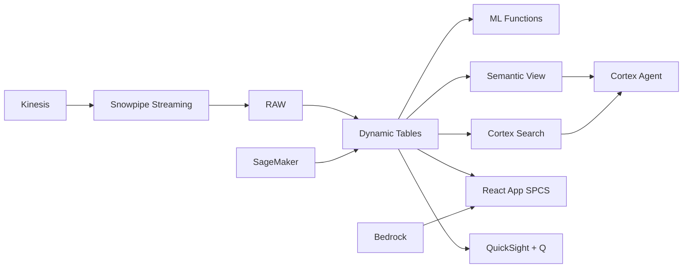

# Ride-Hailing & Super-App Analytics

Real-time demand-supply matching intelligence for Indonesia's super-app economy — ML.FORECAST predicts ride demand, Dynamic Tables build driver allocation dashboards, and Cortex AI generates surge pricing recommendations.

## Architecture

Indonesia's super-app market processes 100 million monthly trips, but fulfillment rates are slipping as driver supply struggles to match peak demand. With surge pricing effectiveness declining and driver churn at 8% monthly, the VP Marketplace needs real-time demand-supply intelligence and ML-powered allocation — not post-hoc analysis of yesterday's failures.



## Snowflake Capabilities

| Capability | Implementation |
|-----------|---------------|
| Dynamic Tables | DEMAND_SUPPLY_BALANCE / FULFILLMENT_METRICS / DRIVER_ECONOMICS / PRICING_EFFECTIVENESS |
| ML Functions | ML.FORECAST |
| Cortex AI | COMPLETE, AI_CLASSIFY, SUMMARIZE |
| Cortex Search | 5000 documents indexed |
| Cortex Agent | MARKETPLACE_OPS_AGENT |
| Semantic View | RIDE_HAILING_ANALYTICS |
| React App (SPCS) | 5 tabs + DemoGuide |


## AWS Services

| Service | Role in Demo |
|---------|-------------|
| Amazon Kinesis | Stream real-time ride requests, GPS, and demand signals |
| Amazon Location Service | Geospatial zone matching and ETA calculation |
| Amazon SageMaker | Demand forecasting and dynamic pricing optimization models |
| AWS Glue | ETL for trip and demand event data processing |
| Amazon Bedrock (Claude) | Generate operational recommendations and incentive strategies |
| Amazon QuickSight + Q | Operations command center with natural language queries |


## Personas

| Persona | Role | Key Questions |
|---------|------|---------------|
| **Bimo Prasetyo** | VP Marketplace Operations | "What's the current fulfillment rate across all services?" "Which zones have driver shortage right now?" |
| **Citra Handayani** | Pricing & Incentives Lead | "What's the surge multiplier impact on demand?" "Show me the incentive spend vs driver supply correlation." |


## Data

| Table | Rows | Description |
|-------|------|-------------|
| TRIPS | 100,000,000 | 12 months of completed and cancelled trip records across transport, food, and courier |
| DRIVERS | 2,000,000 | Active driver-partners with status, rating, vehicle type, and earnings |
| DEMAND_EVENTS | 500,000,000 | Real-time ride requests, searches, and cancellations by zone and time |
| PRICING_LOGS | 50,000,000 | Dynamic pricing decisions with surge multiplier and demand-supply ratio |
| INCENTIVES | 5,000,000 | Driver and rider incentive campaigns with spend and response data |
| ZONE_CONFIG | 5,000 | Geographic zone definitions with demand patterns and service availability |


## Build Instructions

### Prerequisites
- Snowflake account with ACCOUNTADMIN access
- Cortex AI enabled (ML Functions, Search, Agent)
- Warehouse: RIDEHAIL_WH (Medium)
- AWS CLI with access (us-west-2)

### Deployment

```bash
snowsql -f snowflake/00_setup.sql
snowsql -f snowflake/01_marketplace_install.sql
snowsql -f snowflake/02_raw_tables.sql
snowsql -f snowflake/03_staging.sql
snowsql -f snowflake/04_dynamic_tables.sql
snowsql -f snowflake/05_search.sql
snowsql -f snowflake/06_ml_models.sql
snowsql -f snowflake/07_semantic_view.sql
snowsql -f snowflake/08_agent.sql
```

### React App (SPCS)
```bash
cd app && npm ci && npm run build
docker build -t aws-indonesia-digital-economy-ride-hailing-app .
docker push bdiqc8sm-default.registry.snowflakecomputing.com/ride_hailing_analytics/app/aws_indonesia_digital_economy_ride_hailing/app:latest
```

### Demo Mode
Open the app URL with `?demo=true` for presenter view.

## Build Modes

### Snowflake Only
Run scripts 00-08 (skip AWS-specific integration). Uses:
- **Snowpipe Streaming SDK** instead of Amazon Kinesis
- **Snowflake GEOGRAPHY + Dynamic Tables** instead of Amazon Location Service
- **ML.FORECAST** instead of Amazon SageMaker
- **Dynamic Tables** instead of AWS Glue
- **Cortex Complete** instead of Amazon Bedrock (Claude)
- **Snowflake Intelligence (Cortex Analyst)** instead of Amazon QuickSight + Q

### Full AWS + Snowflake
Run all scripts including AWS integration. Deploy QuickSight dashboard from `quicksight/`.

## Business Impact

Industry research and Snowflake customer outcomes:
- **Indonesia's ride-hailing and on-demand services market valued at US$7.5B in 2023** — [Google-Temasek-Bain SEA Report](https://economysea.withgoogle.com/)
- **Gojek and Grab combined serve 38 million MAU in Indonesia across transport, food, and payments** — [App Annie](https://www.data.ai/)
- **1% improvement in fulfillment rate = US$50-75M additional annual revenue at Indonesian scale** — [McKinsey Mobility](https://www.mckinsey.com/industries/automotive-and-assembly/our-insights)
- **ML-optimized pricing increases marketplace revenue by 8-15% while maintaining demand** — [MIT Operations Research](https://web.mit.edu/)


## Key Demo Numbers

- **100M trips/month** across ride, food, and courier services
- **89% fulfillment** trip completion rate (target: 93%)
- **2M drivers** active driver-partners on platform
- **500M events/month** demand events processed in real-time
- **Rp 45B/week** incentive spend on driver and rider campaigns


## License

Apache 2.0 — See [LICENSE](LICENSE) for details.

This is a personal demo project and is not an official Snowflake offering. It comes with no support or warranty.