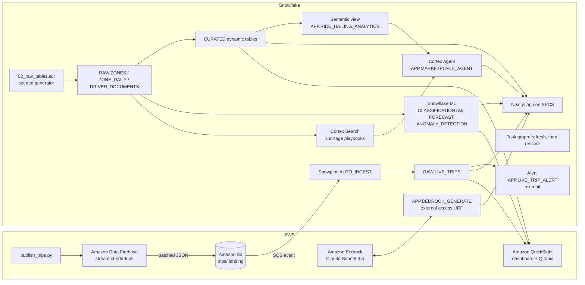

# Indonesia Ride-Hailing Marketplace - Supply Shortage and Fulfillment Operations

End-to-end marketplace operations for **40 service zones of a fictional Indonesian super-app across 5 cities** (Jakarta, Surabaya, Bandung, Medan, Denpasar) and 5 services (bike ride, car ride, food delivery, courier, car XL) using Snowflake, optionally with AWS: from a live unfulfilled trip request to a 7-day supply-shortage risk score, an alert email and an AI action memo for the marketplace operations team.

## Architecture

A marketplace-operations pipeline built on **Snowflake** (Dynamic Tables, Snowflake ML, Cortex Search, Cortex Agent, Cortex AI_COMPLETE, SPCS) and, in the full build, **AWS** (Amazon Data Firehose, S3, Bedrock Claude, QuickSight + Amazon Q). Trip request events land in `RAW.LIVE_TRIPS`. Dynamic tables curate 90 days of zone-day history: requests, completed trips, unfulfilled requests, rider cancellations, supply shortage hours, GMV in IDR and driver incentive payout timeliness. Snowflake ML scores 7-day supply-shortage risk per zone, forecasts marketplace-wide unfulfilled requests and flags pickup ETA anomalies. A Cortex Agent answers questions with playbook citations, and an LLM drafts the operations action memo.

Interactive diagrams (hover for object names): [Snowflake only](docs/architecture-snowflake.html) | [AWS + Snowflake](docs/architecture-aws.html). The app shows both on its Architecture & Data tab, the current build first. Regenerate them with `python3 docs/build_architecture.py`.


```mermaid
flowchart LR
    subgraph AWS
      SIM[publish_trips.py] --> FH[Amazon Data Firehose<br/>stream id-ride-trips]
      FH -->|batched JSON| S3[(Amazon S3<br/>trips/ landing)]
      BR[Amazon Bedrock<br/>Claude Sonnet 4.5]
      QS[Amazon QuickSight<br/>dashboard + Q topic]
    end
    subgraph Snowflake
      S3 -->|SQS event| PIPE[Snowpipe AUTO_INGEST] --> LIVE[RAW.LIVE_TRIPS]
      GEN[02_raw_tables.sql<br/>seeded generator] --> RAW[RAW.ZONES / ZONE_DAILY / DRIVER_DOCUMENTS]
      RAW --> DT[CURATED dynamic tables]
      RAW --> ML[Snowflake ML<br/>CLASSIFICATION risk, FORECAST,<br/>ANOMALY_DETECTION]
      DT --> SV[Semantic view<br/>APP.RIDE_HAILING_ANALYTICS]
      RAW --> CS[Cortex Search<br/>shortage playbooks]
      SV --> AG[Cortex Agent<br/>APP.MARKETPLACE_AGENT]
      CS --> AG
      LIVE --> AL[Alert APP.LIVE_TRIP_ALERT<br/>+ email]
      UDF[APP.BEDROCK_GENERATE<br/>external access UDF]
      TK[Task graph: refresh, then rescore]
      APP[Next.js app on SPCS]
    end
    BR <--> UDF
    DT --> APP
    ML --> APP
    LIVE --> APP
    AG --> APP
    UDF --> APP
    DT --> QS
    ML --> QS
    LIVE --> QS
```

The Snowflake-only build drops the AWS subgraph: `APP.SIMULATE_TRIPS` writes to `RAW.LIVE_TRIPS`, and the app calls Cortex `AI_COMPLETE` instead of the Bedrock UDF.

## Snowflake Capabilities

| Capability | Implementation |
|-----------|---------------|
| Dynamic Tables | `CURATED.KPI_SUMMARY`, `PERFORMANCE_SUMMARY`, `CAUSE_SUMMARY`, `TREND_ANALYSIS` from the RAW tables |
| Snowflake ML | CLASSIFICATION 7-day supply-shortage risk (`ML.SHORTAGE_RISK_SCORES`), 14-day unfulfilled-request FORECAST, pickup ETA ANOMALY_DETECTION |
| Cortex Search | 17 synthetic supply-shortage playbooks (one per service and shortage cause) in `SEARCH.PLAYBOOK_SEARCH` |
| Semantic View | `APP.RIDE_HAILING_ANALYTICS` over zones, shortage causes, daily totals and risk |
| Cortex Agent | `APP.MARKETPLACE_AGENT`: Cortex Analyst over the semantic view plus Cortex Search for playbook citations |
| Cortex AI | `AI_COMPLETE('claude-sonnet-4-5')` for grounded answers, and for the action memo in the Snowflake-only build |
| Alerts + Tasks | `APP.LIVE_TRIP_ALERT` logs UNFULFILLED requests and sends email; task graph `TASK_REFRESH_CURATED`, then `TASK_RESCORE_RISK` |
| Snowpark Container Services | Next.js app `APP.ID_RIDE_APP` with 6 tabs: Executive Cockpit, Predictive, Controls, Live Trips, Ask AI, Architecture & Data |
| Snowpipe | `RAW.LIVE_TRIPS_PIPE` AUTO_INGEST from S3 (AWS build only) |

## AWS Services

Used only in the AWS + Snowflake build.

| Service | Role in Demo |
|---------|-------------|
| Amazon Data Firehose | Direct PUT stream `id-ride-trips` receives simulated trip request events and writes batches to S3 |
| Amazon S3 | Landing bucket (`trips/`). An event notification goes to the Snowpipe SQS queue |
| Amazon Bedrock | Claude Sonnet 4.5 writes the action memo, called from Snowflake through an external-access UDF |
| Amazon QuickSight | DIRECT_QUERY executive dashboard over Snowflake (daily unfulfilled requests, shortage hours by zone, supply-shortage risk) |
| Amazon Q | Natural-language questions over the QuickSight topic `id-ride-topic` |
| AWS IAM | Least-privilege roles for S3, Firehose and Bedrock |

## Personas

These personas are fictional.

| Persona | Role | Key Questions |
|---------|------|---------------|
| **Bimo Prasetyo** | VP Marketplace Operations | "What is our fulfillment rate across cities and services?" "Which shortage causes cost us the most unfulfilled requests?" |
| **Citra Handayani** | Driver Supply & Incentives Lead | "Which zones are at risk of a driver shortage this week, and which playbook applies?" |

## Data

All data is synthetic and seeded, so every rebuild reproduces it. The super-app, zones and names are fictional; the cities are real Indonesian cities used as regions.

| Table | Rows | Description |
|-------|------|-------------|
| RAW.ZONES | 40 | Service zones: one of 5 services (Bike ride, Car ride, Food delivery, Courier, Car XL) in one of 5 cities, with congestion tier and driver incentive payout cycle |
| RAW.ZONE_DAILY | 3,600 | Daily zone observations over 90 days: requests, completed trips, unfulfilled requests, rider cancellations, GMV (IDR), supply shortage hours and cause, payouts due and settled, average surge and pickup ETA |
| RAW.DRIVER_DOCUMENTS | 40 | Required, on-file and pending driver compliance checks per zone (SIM, STNK, SKCK, food handling) |
| SEARCH.PLAYBOOK_DOCS | 17 | Synthetic supply-shortage playbooks indexed for Cortex Search |
| RAW.LIVE_TRIPS | Grows during the demo | Live trip request events from Firehose (AWS build) or `APP.SIMULATE_TRIPS` (Snowflake-only build) |
| ML.SHORTAGE_RISK_SCORES | 40 | 7-day supply-shortage probability and risk band per zone |

## Build Instructions

### Prerequisites
- Snowflake account with ACCOUNTADMIN access, and Cortex AI enabled (AI_COMPLETE, Search, Agent).
- An X-Small warehouse with auto-suspend at or below 120 s, and an existing SPCS compute pool.
- Python 3.11+, `snowflake-connector-python`, Node.js 22+, Docker and the `snow` CLI.
- App image: run `snow spcs image-registry login`, then build and push `id-ride-app:v1` to the database's `APP.IMAGES` repository (see the header of `snowflake/07_deploy_app.sql`).
- AWS build only: `boto3`, AWS credentials for the target account (us-west-2) with Bedrock access, and QuickSight Enterprise.

### SPCS App
```
<DATABASE>.APP.ID_RIDE_APP
```

### Tests
```bash
python -m pytest aws snowflake quicksight
```

For a local run, put `SNOWFLAKE_ACCOUNT`, `SNOWFLAKE_USER`, `SNOWFLAKE_DATABASE`, `SNOWFLAKE_WAREHOUSE`, `SNOWFLAKE_AUTHENTICATOR=PROGRAMMATIC_ACCESS_TOKEN`, `SNOWFLAKE_TOKEN` and `DEMO_PLATFORM` in the environment, then run `npm --prefix app run build && npm --prefix app start`.

## Build Modes

Both modes share the same core. They differ in three places, and the app's `DEMO_PLATFORM` setting (in its SPCS spec) switches the memo provider and the Live Trips tab.

| Layer | Snowflake Only | Full AWS + Snowflake |
|---|---|---|
| Live trips | `CALL APP.SIMULATE_TRIPS(n)` inserts simulated trip request events into `RAW.LIVE_TRIPS`. This simulates a trip feed; it is not Snowpipe Streaming | `aws/publish_trips.py` to Amazon Data Firehose, then S3, SQS and Snowpipe AUTO_INGEST |
| Action memo | Cortex `AI_COMPLETE('claude-sonnet-4-5')` | Amazon Bedrock Claude Sonnet 4.5 through `APP.BEDROCK_GENERATE` |
| BI and natural-language questions | The SPCS app is the dashboard; questions go to the Cortex Agent | Also a QuickSight dashboard and an Amazon Q topic |
| App setting | `DEMO_PLATFORM: snowflake` | `DEMO_PLATFORM: aws` |

### Snowflake Only

```bash
# 1. Core data and dynamic tables (guarded: new isolated database only)
python snowflake/run_core.py --database INDONESIA_RIDE_HAILING_SNOWFLAKE --warehouse <XS_WAREHOUSE> --connection <CONNECTION> --apply
# 2. Native trip feed, ML, search, semantic view, agent, alert and task graph
python snowflake/run_intelligence.py --database INDONESIA_RIDE_HAILING_SNOWFLAKE --platform snowflake --warehouse <XS_WAREHOUSE> --connection <CONNECTION> --alert-email you@example.com
# 3. App on SPCS with DEMO_PLATFORM=snowflake (push the image first)
python snowflake/run_intelligence.py --database INDONESIA_RIDE_HAILING_SNOWFLAKE --platform snowflake --warehouse <XS_WAREHOUSE> --connection <CONNECTION> --alert-email you@example.com --files 07_deploy_app.sql --compute-pool <COMPUTE_POOL>
```

During the demo:
- Run `CALL APP.SIMULATE_TRIPS(20)` to add live trip request events. For a continuous feed, run `ALTER TASK APP.TASK_SIMULATE_TRIPS RESUME`, and `SUSPEND` it afterwards.
- Run `EXECUTE ALERT APP.LIVE_TRIP_ALERT` to raise the alert email.
- Run `EXECUTE TASK APP.TASK_REFRESH_CURATED` to refresh the curated tables and rescore risk.

Afterwards, drop the database or run `ALTER SERVICE APP.ID_RIDE_APP SUSPEND`.

### Full AWS + Snowflake

```bash
# 1. Core data and dynamic tables (guarded: new isolated database only)
python snowflake/run_core.py --database INDONESIA_RIDE_HAILING_AWS --warehouse <XS_WAREHOUSE> --connection <CONNECTION> --apply
# 2. AWS ingestion and Bedrock (dry run first, then --apply)
python aws/setup_aws.py --database INDONESIA_RIDE_HAILING_AWS --account <AWS_ACCOUNT_ID> --connection <CONNECTION> --apply
# 3. ML, search, semantic view, agent, alert and task graph
python snowflake/run_intelligence.py --database INDONESIA_RIDE_HAILING_AWS --platform aws --warehouse <XS_WAREHOUSE> --connection <CONNECTION> --alert-email you@example.com
# 4. App on SPCS with DEMO_PLATFORM=aws (push the image first)
python snowflake/run_intelligence.py --database INDONESIA_RIDE_HAILING_AWS --platform aws --warehouse <XS_WAREHOUSE> --connection <CONNECTION> --alert-email you@example.com --files 07_deploy_app.sql --compute-pool <COMPUTE_POOL>
# 5. QuickSight dashboard and Q topic (needs an existing Snowflake data source)
python quicksight/build_dashboards.py --database INDONESIA_RIDE_HAILING_AWS --account <AWS_ACCOUNT_ID> --principal-arn <QUICKSIGHT_USER_ARN> --data-source-arn <DATA_SOURCE_ARN> --prefix id-ride --apply --update --with-topic
```

QuickSight objects must be shared with the QuickSight user who signs in (`--principal-arn`); otherwise the console shows nothing.

During the demo:
- Run `python aws/publish_trips.py --count 20` to send live trip request events. Firehose buffers for up to 60 seconds before writing to S3.
- Run `EXECUTE ALERT APP.LIVE_TRIP_ALERT` to raise the alert email.
- Run `EXECUTE TASK APP.TASK_REFRESH_CURATED` to refresh the curated tables and rescore risk.

Afterwards, `python aws/teardown_aws.py --database INDONESIA_RIDE_HAILING_AWS --account <AWS_ACCOUNT_ID> --connection <CONNECTION> --apply` removes the AWS resources and the account-level Bedrock external-access and S3 storage integrations. It leaves the email integration `ID_RIDE_EMAIL_INT`, which the Snowflake-only build also uses.

## Business Impact

Industry research and Snowflake customer outcomes:
- **Southeast Asia transport GMV**: the e-Conomy SEA 2024 report says the "Transport sector has surpassed pre-COVID levels with revenue projected to grow by 36% YoY to $1.5 billion, driven by rebounding demand and pricing, while GMV is expected to increase by 18% to $9 billion" -- [Temasek, e-Conomy SEA 2024 report press release](https://www.temasek.com.sg/en/news-and-resources/news-room/news/2024/-e-conomy-sea-2024-report--profitability-push-in-southeast-asia-)
- **Southeast Asia food delivery GMV**: "In 2024, revenue is set to grow by 54% YoY to reach $1.7 billion, while GMV is expected to increase by 7% to $19 billion" -- [Temasek, e-Conomy SEA 2024 report press release](https://www.temasek.com.sg/en/news-and-resources/news-room/news/2024/-e-conomy-sea-2024-report--profitability-push-in-southeast-asia-)
- **Vay** (Snowflake customer), an on-demand remote-driven car service that bridges "the gap between a car share app and ride-hailing service", reports "12X Faster compute on 80 data sources" and, with Cortex AI, "over 300 hours" saved for customer service agents -- [Snowflake customer story: Vay](https://www.snowflake.com/en/customers/all-customers/case-study/vay/)

## Key Demo Numbers

These figures are synthetic and come from the seeded demo data. Forecast and anomaly figures can shift slightly with the build day.

- **40 service zones** across 5 cities and 5 services, 3,600 zone-days over 90 days; **8,801,326 requests**, **8,221,526 completed trips** and GMV of IDR 213 B
- **Fulfillment rate 93.4%**: **220,569 unfulfilled requests** found no driver, and the rider cancellation rate is 4.1%
- **387 supply shortage hours** on **146 shortage zone-days**; peak commute causes the most (96 hours on 44 zone-days), and the two city-wide flooding days add 64 hours on 16 zone-days
- **Supply-shortage model** out-of-time holdout (600 zone-days): precision 0.32, recall 0.18 at a 0.5 threshold, against a 0.24 base rate. Six zones are high risk; the top zone is ZON-0019, at 86.8%
- **14-day unfulfilled-request forecast** with prediction intervals; **34 of 640** zone-days flagged as pickup ETA anomalies
- **Driver payout on-time rate 79.4%**, driver document coverage 66.7%, with 20 checks pending
- **17 playbooks** indexed for Cortex Search and cited by ID in agent answers

## License

Apache 2.0 — See [LICENSE](LICENSE) for details.

This is a personal demo project and is not an official Snowflake offering. It comes with no support or warranty. Industry metrics cited are from publicly available third-party research and Snowflake customer stories; they represent reported outcomes and are not guarantees of results.
